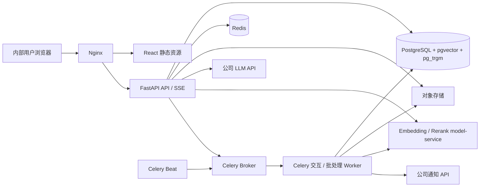

# KnowAgent 系统架构与项目结构（已确认）

> 状态：架构方案已于 2026-08-02 通过用户确认门禁。
>
> 基线：本方案落实 TD-001 至 TD-011，并覆盖 REQ-001 至 REQ-018。

## 1. 架构结论

KnowAgent 采用“模块化单体 Web 应用 + 独立异步 Worker + 独立模型服务”的混合架构。

- `web`：React/TypeScript 单页应用，按用户端和管理端路由分包。
- `api`：FastAPI 模块化单体，承载认证、权限、系统、文档、会话、检索编排、工单和管理 API。
- `worker`：Celery Worker/Beat，复用 API 的应用服务和领域代码；交互队列处理问答流程，批处理队列处理文档、索引、通知、统计和恢复任务。
- `model-service`：独立 Python HTTP 服务，加载成熟 Embedding/Rerank 模型，不保存业务事实。
- PostgreSQL：唯一业务事实源，使用 `pgvector` 和 `pg_trgm` 支持混合检索。
- Redis：只承担服务端 Session、Celery Broker/结果短存和限流等临时状态，不作为业务事实源。
- 对象存储：保存原始文档和可选解析产物；业务元数据与状态仍写 PostgreSQL。
- 公司 LLM API、通知 API：经 Provider 适配器访问，不渗透到领域模型。



选择模块化单体是因为当前团队和访问规模较小，认证、知识发布、引用快照、工单回流存在强事务关系。模型推理和耗时任务独立进程部署，可隔离资源和故障，同时避免过早引入微服务分布式事务。

## 2. 边界与依赖规则

### 2.1 分层

每个业务模块内部按以下方向依赖：

```text
api/worker 入口 -> application 用例 -> domain 规则
                         |
                         v
                   ports 抽象接口
                         ^
                         |
              infrastructure 适配实现
```

硬性规则：

1. `domain` 不依赖 FastAPI、SQLAlchemy、Celery、Redis、厂商 SDK 或 LangGraph。
2. API 路由不直接访问 ORM Repository；只调用应用用例。
3. 模块之间只调用对方公开的 application port，不直接引用对方 ORM 模型或私有 Repository。
4. 跨模块事务由明确的应用用例协调；异步副作用通过 Outbox，不在数据库提交前调用通知 API。
5. LangGraph 只编排类型化节点；检索、权限、证据判定、引用校验和工单事务由领域服务实现。
6. 数据库查询必须把 `system_id` 作为强制条件；提示词中的系统说明不构成隔离措施。

允许的顶层依赖方向：

```text
common/platform <- identity <- systems <- documents/knowledge
common/platform <- conversations <- retrieval <- agent
systems/conversations/knowledge <- tickets <- notifications
conversations/tickets/documents <- analytics
所有写操作 -> audit（通过通用审计端口/应用事件，不反向依赖业务模块）
```

`agent` 可编排公开服务，但被编排模块不得反向依赖 `agent`，因此不存在循环依赖。

## 3. 模块划分

| 模块 | 职责 | 对外能力 | 直接依赖 |
| --- | --- | --- | --- |
| `common` | ID、时间、分页、错误码、事务和类型基元 | `Page[T]`、`DomainError`、`UnitOfWork` | 无 |
| `platform` | 配置、数据库、Redis、对象存储、Outbox、限流、健康检查 | 基础设施 ports 与适配器 | `common` |
| `identity` | 双入口登录、Argon2id、首次改密、Redis Session、RBAC、SSO 边界 | `AuthService`、`AuthorizationService` | `common`, `platform` |
| `systems` | 业务系统、负责人、可见性、启停状态 | `SystemAccessService`、系统管理用例 | `identity` |
| `documents` | 上传、版本、解析、结构化切分、入库任务、发布/下线 | `DocumentService`、`DocumentParser` | `systems`, `platform` |
| `knowledge` | 文档片段、工单知识、来源定位、索引版本和发布视图 | `KnowledgeIndexService`（基础 Embedding 写回已实现）、`CitationResolver` | `documents`, `systems` |
| `conversations` | 会话、消息、回答、引用快照、运行记录、多轮上下文 | `ConversationService`、`RunEventStream` | `identity`, `systems` |
| `retrieval` | 查询改写、关键词/向量混合召回、Rerank、证据候选组织 | `BasicRetrievalService`、`EvidenceOrganizer` 已实现 | `knowledge`, `conversations` |
| `agent` | LangGraph 问答流程、意图分类、证据决策、降级分流、回答与引用校验 | `GroundedAnswerService`、`DeterministicEvidencePolicy`、`ReliableQuestionService` 已实现；`QuestionWorkflow` 待补 | `retrieval`, `conversations`, Provider ports |
| `tickets` | 自动建单、分派、回复、追加、关闭/重开、候选知识审核回流 | `RefusalTicketService` 与自动建单持久化已实现；完整工单状态机和 `KnowledgeCandidateService` 待补 | `systems`, `conversations`, `knowledge` |
| `notifications` | Outbox 消费、模板、公司通知 API、重试和人工重试 | `NotificationDispatcher` | `tickets`, `platform` |
| `analytics` | 高频问题、知识缺口、使用统计、离线评测和版本对比 | 查询服务与聚合任务 | `conversations`, `tickets`, `documents` |
| `audit` | 认证、权限、知识和工单关键操作审计 | `AuditSink`、审计查询 | `common`, `platform` |
| `model-service` | Embedding/Rerank 推理适配、批处理、模型元数据和健康检查 | `/v1/embeddings` 已实现；`/v1/rerank` 待补 | 本地基线依赖 Ollama HTTP，不依赖业务模块 |
| `web` | 用户问答、引用与工单；管理端知识、系统、账号、审计和分析 | 浏览器 UI | API 契约 |

模块职责语义重叠低于 30%。`documents` 管原文件生命周期，`knowledge` 管可检索发布视图；`retrieval` 只产出证据，`agent` 决定如何回答；`tickets` 管人工闭环，`notifications` 只管可靠投递。

## 4. API 契约

### 4.1 通用约定

- 前缀：`/api/v1`；JSON 字段使用 `snake_case`。
- 标识：对外使用 UUID；时间使用带时区 ISO 8601 UTC。
- 分页：`page >= 1`，`1 <= page_size <= 100`，响应为 `Page[T]`。
- 写请求支持 `Idempotency-Key`；文档上传、问答运行和工单建单强制使用。
- Session Cookie：`HttpOnly`、`Secure`、`SameSite=Lax`；非安全方法必须携带 CSRF Token。
- 错误响应：`ApiError { code, message, request_id, details? }`，不返回堆栈和供应商原始错误。
- SSE 支持 `Last-Event-ID` 恢复；持久事件读取完成后，客户端以消息列表接口校准最终状态。
- 问答运行由 Celery `qa` 队列执行；SSE 从持久化 `run_events` 读取，Redis 发布订阅只用于低延迟唤醒，失败时回退 PostgreSQL 轮询。

```python
from collections.abc import Sequence
from datetime import datetime
from typing import Generic, Literal, TypeVar
from uuid import UUID

from pydantic import BaseModel, Field

T = TypeVar("T")

class Page(BaseModel, Generic[T]):
    items: list[T]
    page: int = Field(ge=1)
    page_size: int = Field(ge=1, le=100)
    total: int = Field(ge=0)

class ApiError(BaseModel):
    code: str
    message: str
    request_id: str
    details: dict[str, str | int | bool] | None = None

class SourceLocator(BaseModel):
    document_id: UUID
    document_version_id: UUID
    source_type: Literal["pdf", "docx", "markdown", "xlsx", "ticket"]
    block_index: int
    page_number: int | None = None
    bounding_box: tuple[float, float, float, float] | None = None
    heading_path: tuple[str, ...] = ()
    paragraph_start: int | None = None
    paragraph_end: int | None = None
    line_start: int | None = None
    line_end: int | None = None
    table_index: int | None = None
    table_row_start: int | None = None
    table_row_end: int | None = None
    sheet_name: str | None = None
    cell_range: str | None = None
    ticket_id: UUID | None = None
```

`SourceLocator` 按 `source_type` 做联合校验并始终绑定文档、版本和原始块序号：PDF 必须有页码且可带有限坐标，Word 的段落位置与完整表格行位置互斥，Markdown 同时保留标题路径、语义段落和精确源行且表格字段必须成组出现，Excel 必须有工作表与单元格范围且可选表格字段必须成组出现，工单知识必须有 `ticket_id`。格式专属字段不能混入其他来源类型。

### 4.2 用户与认证 API

| 方法与路径 | 请求 | 响应 | 权限/异常 |
| --- | --- | --- | --- |
| `POST /auth/user/sessions` | `LoginRequest` | `SessionView` | 只允许普通用户/负责人；首次改密账号返回受限 Session；`AUTH_INVALID` |
| `POST /auth/admin/sessions` | `LoginRequest` | `SessionView` | 只允许管理员；错误入口返回统一认证错误 |
| `DELETE /auth/session` | 无 | `204` | 已登录；撤销 Redis Session |
| `GET /auth/me` | 无 | `CurrentUserView` | 已登录 |
| `POST /auth/password/change` | `ChangePasswordRequest` | `204` | 已登录；成功后轮换 Session |
| `POST /admin/accounts` | `AdminCreateRequest` | `AccountView` | 平台管理员；不能创建普通用户批量数据 |
| `GET /admin/accounts` | 分页/角色/状态过滤 | `Page[AccountView]` | 平台管理员 |
| `PATCH /admin/accounts/{account_id}/status` | `AccountStatusRequest` | `AccountView` | 平台管理员；禁止禁用最后一个有效管理员 |
| `GET /auth/sso/{provider}/start` | 回跳地址 | `302` | P2 适配边界，首版可返回 `FEATURE_DISABLED` |
| `GET /auth/sso/{provider}/callback` | Provider 参数 | `302` | P2；映射本地账号并执行禁用校验 |

### 4.3 系统与知识管理 API

| 方法与路径 | 请求 | 响应 | 权限/异常 |
| --- | --- | --- | --- |
| `GET /systems` | 状态过滤 | `list[SystemSummary]` | 返回当前账号可见系统；普通用户响应不包含负责人详情 |
| `GET /admin/systems` | 分页/状态 | `Page[SystemView]` | 平台管理员；包含负责人详情 |
| `POST /admin/systems` | `SystemCreateRequest` | `SystemView` | 平台管理员 |
| `PATCH /admin/systems/{system_id}` | `SystemUpdateRequest` | `SystemView` | 平台管理员 |
| `PUT /admin/systems/{system_id}/owners` | `OwnerAssignmentRequest` | `list[OwnerView]` | 平台管理员 |
| `POST /systems/{system_id}/documents` | multipart 文件 + `Idempotency-Key`；可选 `document_id` 创建下一版本 | `202 IngestionJobView` | 负责人/管理员；格式、大小、系统授权和幂等校验；跨系统 `document_id` 按不存在处理 |
| `GET /systems/{system_id}/documents` | 分页/状态/关键词 | `Page[DocumentView]` | 负责人/管理员；强制系统授权 |
| `GET /document-versions/{version_id}` | 无 | `DocumentVersionView` | 所属系统授权 |
| `GET /ingestion-jobs/{job_id}` | 无 | `IngestionJobView` | 所属系统授权 |
| `POST /ingestion-jobs/{job_id}/retry` | 无 | `202 IngestionJobView` | 仅 `FAILED` 任务可重试；其余状态返回稳定 409 |
| `POST /document-versions/{version_id}/publish` | `PublishRequest` | `DocumentVersionView` | READY_DRAFT 才能发布；事务切换当前版本 |
| `POST /document-versions/{version_id}/retire` | `RetireRequest` | `DocumentVersionView` | 负责人/管理员；不删除历史引用快照 |

### 4.4 问答与会话 API

| 方法与路径 | 请求 | 响应 | 权限/异常 |
| --- | --- | --- | --- |
| `POST /conversations` | `ConversationCreateRequest { system_id }` | `ConversationView` | 已登录且系统可见 |
| `GET /conversations` | 分页/系统/时间 | `Page[ConversationView]` | 只返回本人会话 |
| `GET /conversations/{conversation_id}/messages` | 游标/limit | `CursorPage[MessageView]` | 会话所有者或审计授权 |
| `POST /conversations/{conversation_id}/messages` | `QuestionRequest` | `202 AcceptedRunView` | 幂等；会话系统不可在消息级覆盖 |
| `GET /runs/{run_id}` | 无 | `QuestionRunView` | 运行所属用户或管理授权 |
| `GET /runs/{run_id}/events` | `Last-Event-ID` | `text/event-stream` | 事件：`accepted/retrieving/evidence/answer_delta/completed/refused/degraded/failed` |
| `POST /runs/{run_id}/cancel` | 无 | `QuestionRunView` | 仅进行中运行；最佳努力取消 |
| `POST /messages/{message_id}/feedback` | `FeedbackRequest` | `FeedbackView` | 消息所属用户；一条消息一次当前反馈 |

`failed` 只表示模型、数据库或外部设施故障，不创建知识缺口工单；`refused` 表示检索成功但证据不足/冲突，可创建工单。

### 4.5 工单、运营与配置 API

| 方法与路径 | 请求 | 响应 | 权限/异常 |
| --- | --- | --- | --- |
| `GET /tickets` | 分页/系统/状态/负责人 | `Page[TicketView]` | 用户看自己的，负责人看所属系统 |
| `GET /tickets/{ticket_id}` | 无 | `TicketDetailView` | 提问人、负责人或管理员 |
| `POST /tickets/{ticket_id}/replies` | `TicketReplyRequest` | `TicketReplyView` | 授权参与者 |
| `POST /tickets/{ticket_id}/assign` | `AssignTicketRequest` | `TicketView` | 系统负责人/管理员 |
| `POST /tickets/{ticket_id}/close` | `CloseTicketRequest` | `TicketView` | 负责人/管理员 |
| `POST /tickets/{ticket_id}/reopen` | `ReopenTicketRequest` | `TicketView` | 关闭后允许的参与者 |
| `POST /tickets/{ticket_id}/knowledge-candidates` | `CandidateCreateRequest` | `CandidateView` | 负责人/管理员 |
| `POST /knowledge-candidates/{candidate_id}/review` | `CandidateReviewRequest` | `CandidateView` | 负责人不得审核自己提交的高风险变更；策略可配置 |
| `GET /admin/analytics/questions` | 系统/时间/粒度 | `QuestionAnalyticsView` | 负责人限所属系统，管理员全局 |
| `GET /admin/audit-logs` | 分页/操作者/动作/对象/时间 | `Page[AuditLogView]` | 平台管理员 |
| `GET /admin/notification-deliveries` | 分页/状态 | `Page[NotificationView]` | 平台管理员 |
| `POST /admin/notification-deliveries/{id}/retry` | 无 | `NotificationView` | 永久失败需人工重试 |
| `GET /admin/retrieval-profiles` | 分页/系统/状态 | `Page[RetrievalProfileView]` | 平台管理员 |
| `POST /admin/retrieval-profiles` | `RetrievalProfileCreateRequest` | `RetrievalProfileView` | 平台管理员；新建不可变版本 |
| `POST /admin/retrieval-profiles/{id}/activate` | 无 | `RetrievalProfileView` | 平台管理员；激活与回滚均审计 |
| `GET /admin/prompt-versions` | 分页/场景/状态 | `Page[PromptVersionView]` | 平台管理员 |
| `POST /admin/prompt-versions` | `PromptVersionCreateRequest` | `PromptVersionView` | 平台管理员；新建不可变版本 |
| `POST /admin/prompt-versions/{id}/activate` | 无 | `PromptVersionView` | 平台管理员；发布与回滚均审计 |
| `POST /admin/evaluation-runs` | `EvaluationRunRequest` | `EvaluationRunView` | 平台管理员；异步执行 |

### 4.6 核心 Schema 字段

以下字段是 API 的最小稳定契约；实现阶段可增加向后兼容字段，删除、改名或改变语义必须走变更门禁。

| Schema | 字段（名称: 类型） |
| --- | --- |
| `LoginRequest` | `username: str`, `password: str` |
| `SessionView` | `user: CurrentUserView`, `must_change_password: bool`, `csrf_token: str`, `expires_at: datetime` |
| `CurrentUserView` | `id: UUID`, `username: str`, `role: USER \| SYSTEM_OWNER \| ADMIN`, `status: ACTIVE \| DISABLED`, `system_roles: list[SystemRoleView]` |
| `AdminCreateRequest` | `username: str`, `display_name: str`, `temporary_password: str` |
| `SystemCreateRequest` | `code: str`, `name: str`, `description: str \| None`, `status: ACTIVE \| DISABLED` |
| `OwnerAssignmentRequest` | `account_ids: list[UUID]`, `replace_existing: bool` |
| `DocumentVersionView` | `id: UUID`, `document_id: UUID`, `system_id: UUID`, `filename: str`, `version_no: int`, `parse_status`, `publish_status`, `error_code: str \| None`, `created_at: datetime` |
| `IngestionJobView` | `id: UUID`, `version_id: UUID`, `stage`, `status`, `progress: int`, `attempt: int`, `error_code: str \| None`, `updated_at: datetime` |
| `ConversationCreateRequest` | `system_id: UUID` |
| `QuestionRequest` | `content: str`；`system_id` 不允许由消息覆盖 |
| `AcceptedRunView` | `run_id: UUID`, `question_message_id: UUID`, `status: ACCEPTED`, `events_url: str` |
| `RunEvent` | `id: str`, `run_id: UUID`, `sequence: int`, `type`, `occurred_at: datetime`, `payload: 类型随事件判别` |
| `CitationView` | `id: UUID`, `rank: int`, `source_name: str`, `source_version: str`, `quoted_text: str`, `locator: SourceLocator` |
| `TicketView` | `id: UUID`, `system_id: UUID`, `requester_id: UUID`, `assignee_id: UUID \| None`, `status`, `title: str`, `created_at: datetime`, `updated_at: datetime` |
| `CandidateReviewRequest` | `decision: APPROVE \| REJECT`, `comment: str`, `edited_question: str \| None`, `edited_answer: str \| None` |
| `RetrievalProfileCreateRequest` | `system_id: UUID \| None`, `keyword_top_k: int`, `vector_top_k: int`, `rerank_top_k: int`, `fusion_weights`, `evidence_thresholds`, `model_contract` |
| `PromptVersionCreateRequest` | `scene: str`, `template: str`, `variable_schema: dict[str, JsonValue]`, `change_note: str` |

密码字段永不出现在响应。`RunEvent.payload` 在实现时使用 Pydantic 判别联合：阶段事件只含状态，`answer_delta` 只含增量文本，终态事件含持久消息/工单标识；事件不得携带 Session、完整 Prompt 或未授权证据。

## 5. 内部类型化接口

以下是实现必须遵守的端口，不要求保持具体文件内逐字一致，但参数语义、返回类型和异常分类不得漂移。

```python
from collections.abc import AsyncIterator, Sequence
from dataclasses import dataclass
from typing import Literal, Protocol
from uuid import UUID

Vector = tuple[float, ...]

class ObjectStore(Protocol):
    async def put(self, *, key: str, content: AsyncIterator[bytes], content_type: str) -> None: ...
    async def open(self, *, key: str) -> AsyncIterator[bytes]: ...
    async def delete(self, *, key: str) -> None: ...

class DocumentParser(Protocol):
    def supports(self, *, media_type: str, filename: str) -> bool: ...
    def parse(self, *, content: bytes, document_id: UUID, document_version_id: UUID) -> "ParsedDocument": ...

class EmbeddingProvider(Protocol):
    async def embed(self, *, texts: Sequence[str]) -> "EmbeddingBatch": ...

class RerankProvider(Protocol):
    async def rerank(self, *, query: str, candidates: Sequence["CandidateText"], top_k: int) -> Sequence["RankedCandidate"]: ...

class LlmProvider(Protocol):
    async def generate(self, *, request: "GenerationRequest") -> AsyncIterator["GenerationEvent"]: ...

class NotificationProvider(Protocol):
    async def send(self, *, request: "NotificationRequest", idempotency_key: str) -> "DeliveryReceipt": ...

class RetrievalService(Protocol):
    async def retrieve(self, *, system_id: UUID, query: str, profile_id: UUID) -> "RetrievalResult": ...

class EvidencePolicy(Protocol):
    def decide(self, *, query: str, evidence: Sequence["EvidenceItem"], policy_version: str) -> "EvidenceDecision": ...

class QuestionWorkflow(Protocol):
    async def start(self, *, actor_id: UUID, conversation_id: UUID, question: str, idempotency_key: str) -> UUID: ...
    async def events(self, *, run_id: UUID, after_event_id: str | None) -> AsyncIterator["RunEvent"]: ...

class TicketService(Protocol):
    async def create_from_refusal(self, *, run_id: UUID, decision_id: UUID) -> UUID: ...

class AuthorizationService(Protocol):
    async def require_system_permission(self, *, actor_id: UUID, system_id: UUID, permission: str) -> None: ...
```

`DocumentParser` 是 CPU/内存密集的同步 worker 端口，不得在 FastAPI 事件循环中直接执行；持久入库任务在独立 Celery worker 中调用，并由任务层配置软/硬超时和进程资源边界。

统一异常族：`ValidationError`、`AuthenticationError`、`AuthorizationError`、`ConflictError`、`NotFoundError`、`RateLimitError`、`ProviderUnavailableError`、`InfrastructureError`。只有 `EvidenceDecision.outcome` 为 `INSUFFICIENT` 或 `CONFLICTING` 时允许自动建单。

### 5.1 模型服务契约

- `POST /v1/embeddings`：`EmbeddingRequest { model, texts[] }` -> `{ model, model_version, dimension, normalized, vectors[][] }`。
- `POST /v1/rerank`：`RerankRequest { model, query, documents[], top_k }` -> `{ model, model_version, results[{ index, score }] }`。
- `GET /health/live`：进程存活；`GET /health/ready`：模型已加载且可推理。
- 请求必须限制文本数、单文本长度、总字符数和并发；维度与数据库当前索引配置不一致时拒绝写入。

Provider 可由内部 HTTP、自建运行时或后续公司 API 实现；领域服务只依赖上述契约。

当前本地实现由 `model-service` 调用 Ollama：优先使用 `/api/embed`，旧版回退 `/api/embeddings`，再统一校验维度并归一化。该适配只存在于模型服务边界，`backend` 不感知 Ollama 协议；生产可替换为 PyTorch、ONNX Runtime 或其他内部服务而不改变主应用契约。

## 6. 数据模型

所有业务表包含 UUID 主键、`created_at`、`updated_at`；可变核心表使用乐观锁版本。高频查询索引在迁移阶段通过真实查询计划验证。

| 数据域 | 表 | 关键字段与约束 |
| --- | --- | --- |
| 认证 | `accounts` | `username` 唯一、密码摘要、角色、来源、状态、`must_change_password`、`session_version`、外部身份预留 |
| 认证 | `account_system_roles` | `account_id + system_id + role` 唯一；负责人权限来源 |
| 系统 | `business_systems` | 唯一 `code`、名称、状态、默认负责人策略 |
| 系统 | `system_access_rules` | P2 部门/用户组可见性；首版默认启用系统级公开策略 |
| 文档 | `documents` | `system_id`、逻辑文档名、`current_published_version_id`；当前指针以 `version_id + document_id + system_id` 复合引用版本 |
| 文档 | `document_versions` | 冗余 `system_id`、对象键、文件名、媒体类型、SHA-256、版本号、解析/发布状态；`document_id + version_no` 唯一，`document_id + system_id` 复合引用文档 |
| 文档 | `ingestion_jobs` | 原始 nullable `requested_document_id`、阶段、状态、进度、attempt、租约、错误码、Celery task id；`actor_id + system_id + idempotency_key` 唯一 |
| 知识 | `knowledge_sources` | 来源类型 `DOCUMENT/TICKET`、`system_id`、源版本/工单、发布状态；文档来源以 `document_version_id + system_id` 复合外键约束 |
| 知识 | `knowledge_chunks` | `system_id`、source、文本、`SourceLocator` JSONB、结构路径、序号、token 数、模型版本、检索文本和 nullable 无固定维度向量；以 `source_id + system_id` 复合外键约束；固定维度/HNSW 在模型契约最终确认后补充 |
| 会话 | `conversations` | `owner_id`、不可变 `system_id`、标题、状态、最近活动时间 |
| 会话 | `messages` | 会话、角色、内容、状态、序号；`conversation_id + sequence` 唯一 |
| 问答 | `question_runs` | 问题消息、状态、意图、查询改写、模型/提示词/检索配置版本、降级标记、错误分类 |
| 问答 | `run_events` | 运行内递增序号、事件类型、最小载荷；用于 SSE 断线恢复和诊断 |
| 问答 | `evidence_decisions` | outcome、证据分数、阈值版本、理由代码、候选摘要 |
| 问答 | `answers` | 回答消息、置信状态、完整/拒答/降级结果、生成模型元数据 |
| 问答 | `answer_citations` | answer、chunk/source、排序、引用文本快照、定位快照、文档显示名和版本快照 |
| 工单 | `tickets` | `system_id`、提问人、来源运行、负责人、状态、优先级、去重指纹；来源运行唯一防重复建单 |
| 工单 | `ticket_replies` | 工单、作者、正文、可见性、序号 |
| 工单 | `knowledge_candidates` | 工单、标准问题、答案、审核状态、提交人、审核人、审核意见、发布 source id |
| 通知 | `outbox_events` | 聚合类型/id、事件类型、payload、状态、attempt、下次重试、幂等键唯一 |
| 通知 | `notification_deliveries` | outbox、接收人、模板、Provider 请求/回执摘要、状态、失败分类 |
| 配置 | `prompt_versions` | 场景、版本、模板、变量 schema、状态、checksum；已使用版本不可修改 |
| 配置 | `retrieval_profiles` | 系统/全局、top-k、权重、阈值、模型版本、状态；版本化发布 |
| 分析 | `message_feedback` | 消息、用户、评价与可选原因；`message_id + user_id` 唯一 |
| 分析 | `evaluation_datasets/runs/cases` | 固定问题集、期望、配置快照、逐例结果和汇总指标 |
| 审计 | `audit_logs` | actor、动作、对象、system、结果、request id、前后值摘要；仅追加 |

隔离索引基线：`knowledge_chunks(system_id, publish_status)`、`documents(system_id, status)`、`tickets(system_id, status, assignee_id)`、`conversations(owner_id, system_id, last_activity_at)`。混合检索 SQL 必须在向量距离和关键词排名计算前限定 `system_id` 与已发布状态。

### 6.1 状态机

```text
DocumentVersion processing:
UPLOADED -> PARSING -> CHUNKING -> CHUNKED -> INDEXING -> READY_DRAFT
               |          |                    |
               +-------> FAILED <---------------+
               +-------> OCR_REQUIRED

DocumentVersion publication:
DRAFT -> PUBLISHED -> RETIRED

QuestionRun:
ACCEPTED -> RUNNING -> COMPLETED | REFUSED | FAILED | CANCELLED

Ticket:
OPEN -> ASSIGNED -> IN_PROGRESS -> RESOLVED -> CLOSED
  ^                                  |          |
  +----------------------------------+-- REOPEN-+

KnowledgeCandidate:
DRAFT -> SUBMITTED -> APPROVED -> PUBLISHING -> PUBLISHED
                    -> REJECTED
```

处理状态与发布状态独立，避免退役版本丢失解析结果。状态转换必须由领域服务完成并写审计；不允许 API 直接写任意状态。发布新文档版本时，同一事务切换当前发布指针，旧版本、来源和片段同步退役，但历史引用记录保留快照。

## 7. 核心数据流

### 7.1 文档入库

1. API 校验角色、`system_id` 权限、扩展名、MIME、大小和 SHA-256，并以流式方式写入 S3 兼容对象存储；该阶段已实现。
2. 对象写入后由 PostgreSQL 短事务创建 `document`、`document_version` 和 `ingestion_job`；追加版本在文档行锁内分配版本号并刷新逻辑文档时间。幂等键按账号与业务系统划分作用域，请求指纹包含原始 nullable `document_id`，完全相同的重复请求返回已有任务；提交后仅向 Celery 投递 `job_id`，该阶段已实现。
3. Worker 通过数据库租约领取任务，选择格式专用 Parser，输出结构块和统一 `SourceLocator`；任务阶段、进度、尝试次数和可诊断错误持续入库。每次状态写入都校验租约 owner、attempt 与有效期，过期 Worker 不得覆盖新执行，该阶段已实现。
4. Chunker 按标题、段落、页、工作表和 token 上限切分，不跨越不可追溯的结构边界，并将确定性 `chunks-v1.json` manifest 写入对象存储；完成后版本停在 `CHUNKED`，不得提前标记 `READY_DRAFT`，该阶段已实现。
5. `knowledge_sources`/`knowledge_chunks`、独立发布状态、复合 `system_id` 外键和事务发布/退役服务已实现；所有仓储读取均要求显式系统过滤。
6. `KnowledgeIndexService` 已实现批量调用 Embedding、模型名/版本/维度/归一化/数量校验和单事务向量写回；接入入库 Worker 的索引阶段仍待补充。
7. 在暂存状态批量写入 chunks；全部成功后将版本置为 `READY_DRAFT`，失败则记录阶段和可诊断错误，不暴露半成品索引。基础写入与发布事务已实现，Embedding 编排尚未接入 Worker。
8. 负责人发布后事务切换可检索版本。扫描 PDF 进入 `OCR_REQUIRED`，旧 `.doc/.xls` 返回明确不支持。

恢复策略：Beat 定时扫描未派发、到期重试和租约过期的未终态任务，根据数据库事实重新排队；恢复时版本同步回到 `UPLOADED`，自动重试耗尽后进入 `FAILED`，人工重试重置尝试预算。Celery 状态不用于决定业务是否完成。

### 7.2 问答、引用和拒答

Phase 2 前两项当前实现边界：`retrieval` 已提供 PostgreSQL 关键词/向量查询、数据库层系统/发布状态过滤、RRF、数据库异常降级日志和指标端口；`agent` 已提供版本化问答 Prompt、Qwen OpenAI 兼容流、证据预算、声明级结构化回答、逐字支撑校验、确定性证据决策和可靠拒答；`tickets` 已提供拒答判定与自动建单的同事务持久化、运行幂等和系统内时间窗合并。当前声明/引用快照只作为领域结果返回，问答 API/SSE、会话/答案持久化、完整 `QuestionWorkflow` 和工单处理状态机仍待实现。

1. 创建会话时固定 `system_id`；每次提问再次校验用户对该系统的访问权限。
2. 事务持久化问题消息、`question_run` 和任务派发事实，提交后投递 Celery `qa` 队列并立即返回 run id。
3. 交互 Worker 通过租约领取运行，执行工作流；工作流识别意图并基于有限历史改写检索问题，原问题始终保留。
4. Retrieval 在数据库层限定 `system_id` 和发布状态，执行关键词/向量召回、去重融合；Rerank 不可用时记录降级并使用融合分数。
5. EvidencePolicy 基于覆盖度、相关度、来源一致性和阈值版本返回 `SUFFICIENT/INSUFFICIENT/CONFLICTING/UNAVAILABLE`。
6. `SUFFICIENT` 才允许 LLM 基于证据生成；CitationValidator 检查答案事实是否绑定证据，失败则拒答或降级，不补造引用。
7. 在一个数据库事务中持久化答案、引用文本/定位快照、运行结果和最终事件；SSE 读取持久事件，Redis 只加速实时唤醒。
8. `INSUFFICIENT/CONFLICTING` 返回明确拒答并以 `run_id` 幂等创建工单；`UNAVAILABLE` 或基础设施错误返回故障状态，不计知识缺口、不创建工单。

Worker 异常退出后，恢复任务扫描超时租约并重新投递未到终态的 run；节点副作用以 `run_id + node + attempt` 幂等。`answer_delta` 可批量持久化以控制写放大，最终答案必须以 PostgreSQL 消息记录为准。

### 7.3 工单回答回流

1. 自动工单携带系统、提问人、来源问题、证据决策和会话链接，并按系统负责人规则分派。
2. 工单事务写入后产生 Outbox，通知消费者调用公司 API；通知失败不回滚工单。
3. 负责人回复、用户追加、关闭和重开均走状态机并写审计。
4. 负责人将稳定答案整理为知识候选；审核者确认标准问题、答案、适用系统和来源。
5. 审核通过后创建 `TICKET` 来源和索引任务；发布成功才标记候选 `PUBLISHED`。
6. 新知识在配置目标 5 分钟内进入同一受控检索链路，保留工单来源，可独立下线。

## 8. 部署拓扑

### 8.1 环境

| 环境 | 目的 | 数据隔离 |
| --- | --- | --- |
| 本地开发 | 单模块开发、单元测试 | 本地配置；不依赖 Docker |
| 集成测试 | PostgreSQL/Redis/对象存储/模型真实契约验证 | 独立 Schema、Redis namespace、Bucket 和测试端点 |
| 类生产 | Linux 安装、升级、回滚和容量验证 | 独立实例或严格隔离命名空间 |
| 生产 | 内网正式服务 | 最小权限账号、正式备份与告警 |

### 8.2 Linux 进程

```text
/opt/knowagent/
  releases/<release-id>/
  shared/config/knowagent.env
  shared/data/
  current -> releases/<release-id>

systemd:
  knowagent-api.service
  knowagent-worker-interactive.service  # qa 队列，低并发低延迟
  knowagent-worker-batch.service        # ingestion/notification/analytics 队列
  knowagent-beat.service
  knowagent-model.service

Nginx:
  /                 -> frontend/dist
  /api/             -> 127.0.0.1:<api-port>
  /api/v1/runs/...  -> SSE，禁用响应缓冲并设置合理超时
```

API、Worker、Beat、Model 使用独立低权限系统账号或最小共享组。配置文件位于 release 外，权限 `0600`；日志写 journald/受控日志目录。数据库迁移在切换 `current` 前单独执行，只允许向后兼容迁移；应用回滚不自动回滚破坏性 Schema。

健康检查分层：`/health/live` 只检查进程，`/health/ready` 检查必要配置和数据库；Redis、对象存储、模型和外部 API 状态作为依赖详情，不应因可降级依赖短暂失败导致 API 进程反复重启。

## 9. 非功能性设计

### 9.1 性能与容量

以下是首轮工程预算，不替代真实环境压测：

- 交互 API 不执行解析、Embedding 或批量统计；文档上传请求在对象写入完成后快速返回异步任务。
- 问答使用 SSE 逐步反馈；外部模型调用设置连接、读取和总超时，有限重试只用于幂等请求。
- 所有列表服务端分页；会话消息使用游标分页；管理端图表和文档预览按路由懒加载。
- Embedding 批处理并配置总字符数、批大小和并发；Rerank 只处理有限候选。
- 为数据库连接池、Celery `qa/ingestion/notification/analytics` 队列和模型并发设置独立上限，避免文档批处理阻塞交互问答。
- 基于 10 余名日活和未来增长做首次压测；用真实样本确定 P95、队列容量和模型规格，不提前承诺未测数值。

### 9.2 安全

- Argon2id 只存摘要；默认密码首次强制修改，未改密 Session 仅可调用改密、当前用户和退出接口。
- 登录按账号、来源 IP 和入口限流；失败响应不泄露账号、角色或禁用状态。
- 服务端 Session 可撤销，改密/禁用递增 `session_version` 使旧 Session 失效；所有状态变更校验 CSRF。
- RBAC 与系统归属同时校验；管理员入口和用户入口在后端检查允许角色。
- 上传做文件签名、扩展名、MIME、大小、压缩比和解析资源限制；解析 Worker 不执行宏、公式或外部链接。
- 文档、问题、检索内容均视为不可信；系统提示与证据分隔，拒绝文档内的指令覆盖，工具能力使用白名单。
- 日志不记录密码、Cookie、Token、完整文档或默认完整会话正文；审计只保存必要摘要和对象标识。
- 对象存储使用不可预测 key 和服务端授权，不向浏览器暴露长期凭据。

### 9.3 可观测性

- 每个 HTTP 请求、任务、问答运行、外部调用使用 `request_id/trace_id/run_id/job_id` 关联。
- 结构化日志字段至少包含模块、操作、结果、延迟、错误分类和降级原因。
- 指标覆盖 API 延迟/错误率、Session/登录失败、队列积压、任务阶段耗时、解析失败、Embedding/Rerank/LLM 延迟、拒答率、无引用率、工单响应、Outbox 积压和通知失败。
- 告警优先关注无法回答链路污染、跨系统查询异常、队列长期积压、发布失败和通知永久失败。
- 配置、提示词、模型和检索 Profile 版本随 run 持久化，支持离线复盘。

## 10. 降级与失败处理

| 故障 | 行为 | 是否建工单 | 记录 |
| --- | --- | --- | --- |
| Rerank 超时/不可用 | 使用关键词+向量融合排序，标记 `degraded` | 否 | Provider 延迟、错误分类、Profile 版本 |
| 向量检索不可用但关键词可用 | 仅关键词召回并提高证据门槛 | 仅证据真实不足时 | 降级原因和证据决策 |
| Embedding 入库失败 | 版本不发布，任务有限重试 | 否 | job 阶段、attempt、模型契约 |
| LLM API 不可用 | 返回系统暂不可用，不生成事实答案 | 否 | `ProviderUnavailableError` |
| 检索成功但证据不足 | 明确拒答 | 是，按 run 幂等 | EvidenceDecision |
| 来源相互冲突 | 告知需人工确认 | 是，按 run 幂等 | 冲突来源快照 |
| 通知 API 失败 | 工单仍成功，Outbox 重试 | 否 | delivery 状态和人工重试入口 |
| Redis Session 不可用 | 拒绝需要登录的新请求，不退化为无认证 | 否 | 安全告警 |
| SSE 断开 | 客户端带事件 ID 重连，再拉最终消息 | 否 | run event 序号 |
| Redis 实时事件通道不可用 | SSE 回退到 PostgreSQL 短轮询，最终状态不丢失 | 否 | 降级时长与轮询次数 |
| Worker 中断 | 租约过期后恢复或进入人工重试 | 否 | PostgreSQL 任务事实状态 |

重试仅用于明确可重试且幂等的操作，默认指数退避并设上限。业务校验、权限错误、永久格式错误和模型维度不匹配不自动重试。

## 11. 风险与权衡

| 风险/权衡 | 影响 | 缓解与门禁 |
| --- | --- | --- |
| PostgreSQL 不允许 `vector`/`pg_trgm` | 核心检索方案不可实施 | DBA 在实现前验证扩展；失败则回到 TD-002，不绕过 |
| 模型服务器资源未知 | 模型延迟、内存和并发不可确定 | 用 ESB 样本对 PyTorch/ONNX/量化实测后锁定运行时 |
| 公司 LLM/通知协议及真实对象存储端点契约待验证 | Provider 细节、错误策略和 S3 兼容差异待定 | 保持稳定 port；在隔离 Bucket 验证签名、TLS、multipart、错误映射和权限后再进入类生产 |
| 模块化单体共享数据库 | 模块隔离弱于微服务 | Repository 私有、公开用例接口、架构测试禁止跨模块 ORM 引用 |
| Celery Broker 状态与业务状态可能分叉 | 重复或遗漏执行 | PostgreSQL 幂等键、租约、事实状态和恢复扫描；任务至少一次执行 |
| 本地账号默认密码 | 泄露与横向尝试风险 | 受控摘要生成、首次改密、限流、会话撤销和审计 |
| RAG 阈值缺少真实基线 | 误答或过度拒答 | 50 个以上 ESB 真实问题集、固定失败样本、版本化 Profile |
| 文档中存在 prompt injection | 诱导模型偏离证据 | 内容与指令分隔、无任意工具调用、引用校验和安全评测 |
| 无 Docker 的环境差异 | 开发/生产偏差、升级复杂 | 锁定依赖、systemd 模板、类生产 Linux 安装与回滚演练 |
| SSE 与异步运行增加状态复杂度 | 重连或重复显示 | 持久 run event、递增序号、Redis 仅加速、最终消息事实源和幂等客户端状态机 |

本项目不直接复用 `knowledge-rag` 的 Java/Docker 实现。仅继承 SSE 富事件、引用快照、异步任务事实状态、显式降级和 Nginx 安全配置思路，并以本架构的 Python、systemd 和领域边界重写。

## 12. 需求到模块映射

| 需求 | 实现模块 |
| --- | --- |
| REQ-001 | `identity`, `audit`, `web` |
| REQ-002 | `systems`, `knowledge`, `retrieval`, `web` |
| REQ-003 | `web`, `api` 各业务模块 |
| REQ-004 | `documents`, `knowledge`, `worker`, `model-service` |
| REQ-005 | `retrieval`, `agent`, `conversations`, `knowledge`, `web` |
| REQ-006 | `retrieval`, `agent`, `tickets` |
| REQ-007 | `tickets`, `knowledge`, `documents`, `audit`, `web` |
| REQ-008 | `conversations`, `agent` |
| REQ-009 | `retrieval`, `model-service`, `knowledge` |
| REQ-010 | `notifications`, `platform`, `worker` |
| REQ-011 | `documents`, `knowledge`, `worker` |
| REQ-012 | `analytics`, `conversations`, `tickets`, `web` |
| REQ-013 | `audit`, `identity`, `documents`, `tickets` |
| REQ-014 | `retrieval`, `agent`, `platform` |
| REQ-015 | `identity` SSO adapter |
| REQ-016 | `systems`, `identity` |
| REQ-017 | `analytics`, `retrieval`, `tickets` |
| REQ-018 | `analytics`, `retrieval`, `agent`, `web` |

不存在无需求支撑的业务模块；`common` 和 `platform` 是实现上述需求所需的横向基础模块。

## 13. 目标目录结构

项目按以下目录推进。当前已创建依赖、静态检查配置、账号/系统模块，以及 `documents` 的统一定位、四类解析器和结构感知切分基础；其余业务模块在对应 feature 开始时按需建立。

```text
knowAgent/
  backend/
    pyproject.toml
    src/knowagent/
      api/                 # FastAPI app、middleware、v1 routers
      common/              # 类型基元、错误、分页、UoW 接口
      platform/            # settings、db、redis、S3 object store、outbox
      identity/
      systems/
      documents/           # SourceLocator、parser/chunker、持久入库用例、ORM/repository、API
      knowledge/
      conversations/
      retrieval/
      agent/                # 回答/引用、证据决策、可靠问答编排与判定 ORM
      tickets/              # 拒答自动建单、幂等/去重仓储；完整处理状态机待补
      notifications/
      analytics/
      audit/
      worker/              # Celery app、仅 job_id 的 task/dispatcher、租约恢复 scheduler
    migrations/
    tests/unit/
    tests/integration/
    tests/contract/
  model-service/
    .env.example
    pyproject.toml
    src/knowagent_model/
      app.py             # /v1/embeddings 与健康检查
      cli.py             # 本地/systemd 进程入口
      embedding.py       # 服务端口、结果与稳定错误
      ollama.py          # 新旧 Ollama Embedding API 适配
      settings.py        # 环境配置与边界校验
    tests/unit/
  frontend/
    package.json
    package-lock.json
    tsconfig.json
    eslint.config.js
    vite.config.ts
    src/
      app/                 # router、providers、error boundary
      api/                 # 生成/手写的类型化 API client
      features/auth/
      features/chat/
      features/systems/
      features/documents/
      features/tickets/
      features/analytics/
      features/admin/
      shared/              # UI、hooks、types、design tokens bridge
  deploy/
    systemd/
    nginx/
    scripts/
  scripts/                 # 首个管理员、用户导入、评测和运维脚本
  docs/
  AI_DEVELOPMENT_RULES.md
  QUALITY_RULES.md
```

业务模块推荐内部结构为 `domain/`、`application/`、`ports/`、`infrastructure/`、`api/`；小模块允许合并目录，但依赖方向不变。跨模块共享内容只有在至少两个模块确实复用且语义稳定后才进入 `common`。

## 14. 文件放置与变更规则

| 新内容 | 放置位置 | 约束 |
| --- | --- | --- |
| API Schema/Router | 对应模块 `api/` | 不含业务事务；OpenAPI 可生成前端类型 |
| 领域实体/状态机 | 对应模块 `domain/` | 不导入框架/ORM/SDK 类型 |
| 用例 | 对应模块 `application/` | 一个用例一个清晰事务边界 |
| Repository/Provider 抽象 | 对应模块 `ports/` | 完整 Python 类型标注 |
| SQLAlchemy/HTTP 实现 | 对应模块 `infrastructure/` | 不向领域层泄漏实现类型 |
| Celery Task | `worker/tasks/` | 只反序列化参数并调用幂等应用用例 |
| 前端页面 | `frontend/src/features/<feature>/routes/` | 路由懒加载；业务状态不放共享组件 |
| 前端共享组件 | `frontend/src/shared/` | 必须无具体业务语义并使用设计 token |
| 单元/集成/契约测试 | 对应 `tests/` 分类 | 系统隔离、权限、状态机和 Provider 契约优先 |
| systemd/Nginx/发布脚本 | `deploy/` | 禁止 Docker 运行前提；变更需走 deploy 门禁 |

架构边界、公开 API、数据库 Schema、权限策略、部署进程或外部服务发生变化时，必须先走相应 `change/tech/architect/deploy` 门禁并更新本文件。

## 15. 架构评审结论

已完成以下评审：

1. 模块划分是否覆盖全部需求且没有循环依赖。
2. API 和 Provider 契约是否足以支撑用户端、管理端、异步任务与外部系统。
3. 文档入库、问答拒答、工单回流和历史引用数据流是否完整。
4. `system_id` 强制隔离、认证、默认密码和审计边界是否可接受。
5. systemd + Nginx 部署拓扑是否符合公司无 Docker 约束。
6. PostgreSQL 扩展、模型服务器和公司 API 三项待验证风险是否可接受。

评审结论：用户已确认本方案。正式架构决策已记录，追溯矩阵已推进到 `skeleton`，并已创建依赖与静态检查配置；后续公开 API、数据库 Schema、权限或部署边界发生变化时必须重新执行相应门禁。
